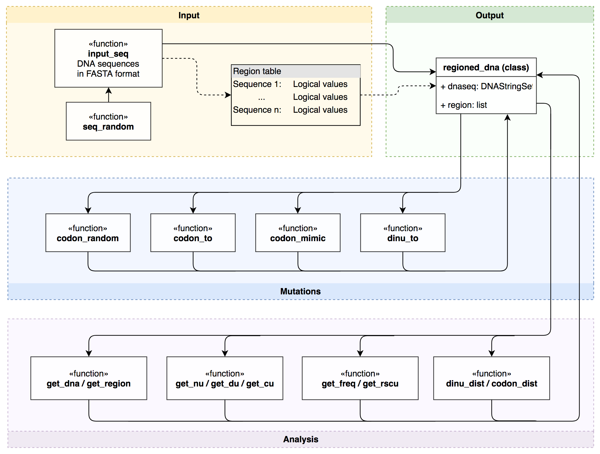

## SynMut: Tools for Designing Synonymously Mutated Sequences with Different Genomic Signatures
*Haogao Gu, Leo L.M. Poon*

  
 
 ##### This work was conducted in School of Public Health, The University of Hong Kong under the supervison of Prof. Leo Poon.

***
[DOI: 10.18129/B9.bioc.SynMut](https://doi.org/doi:10.18129/B9.bioc.SynMut)  


### Introduction

*SynMut* designs synonymous mutants for DNA sequences. 

There are increasing demands on designing virus mutants with specific dinucleotide or codon composition. This tool can take both dinucleotide preference and/or codon usage bias into account while designing mutants. It also works well for desinging mutants with extremely over-/under- represented dinucleotides. 

This tool was originally designed for generating recombinant virus sequences in influenza A virus to study the effects of different dinucleotide usage and codon usage, yet the functions provided in this package can be generic to a variety of other biological researches.

### Components of the package



### Installation 
Use the below code to install the package.

```r
# Stable version
if (!requireNamespace("BiocManager"))
    install.packages("BiocManager")

if (!requireNamespace("SynMut"))
    BiocManager::install("SynMut")

# Development version
if (!requireNamespace("devtools"))
    install.packages("devtools")

if (!requireNamespace("SynMut"))
    devtools::install_github("Koohoko/SynMut", ref = "devel")
```

### Example and methods

Details tutorial please refer to the [vignette](https://bioconductor.org/packages/devel/bioc/vignettes/SynMut/inst/doc/SynMut.html).

The strategies and functionalities of the `codom_mimic` and `dinu_to` functions can be found at [here](https://koohoko.github.io/SynMut/algorithm.html).

### Find it at Bioconductor
https://bioconductor.org/packages/devel/bioc/html/SynMut.html
***

### Maintainer checklist

1. Fetch both remotes and start from the current Bioconductor `upstream/devel`.
   Record the source commit and package version. Review GitHub-only changes
   separately; the package maintenance branch is `devel` on both remotes.
   Bump the patch version and update `inst/NEWS` before the final build.
2. Use the R version appropriate for Bioconductor devel and a dedicated package
   library containing all `Imports` and `Suggests`. Check `BiocManager::valid()`
   and install Pandoc and TeX for the vignette and PDF manual.
3. Download the current [build environment settings](https://bioconductor.org/checkResults/devel/bioc-LATEST/Renviron.bioc)
   to a separate file and select it with `R_ENVIRON_USER` for build/check sessions.
   Set `R_LIBS_USER` to the dedicated library; keep these settings out of the
   global R configuration.
4. In a temporary directory, build a clean source copy with
   `R CMD build --keep-empty-dirs --no-resave-data --md5 SynMut`, then run
   `R CMD check --timings SynMut_<version>.tar.gz`. Keep the complete logs and
   session information. Include tests, examples, vignettes and the PDF manual.
5. Rebuild a clean copy with network access disabled after installing dependencies.
   Confirm that the source archive contains `vignettes/images/component.png` and
   that the generated HTML embeds a valid PNG. Open the HTML to inspect the
   flowchart; a successful build alone does not prove images are valid.
6. Review the final diff and checks before publishing the tested commit to both
   remotes' `devel` branches.
   Check the [official build report](https://bioconductor.org/checkResults/devel/bioc-LATEST/SynMut/)
   after 24-48 hours. Match its version and commit to the published update, and
   inspect the distributed vignette again. Save raw logs immediately if a failure
   occurs because the latest report is overwritten by subsequent builds.

### Changelog
Changes in version 1.1.5 (2022-06-03)
+ Enhancement: add other non-standard genetic codes for functions codon_random, dinu_to, codon_mimic.

Changes in version 1.1.4 (2020-11-12)
+ bug fix: fix for function codon_mimic.

Changes in version 1.1.3 (2019-05-08)
+ Revise dinu_to.keep algorithm, enhance performance.

Changes in version 1.1.2 (2019-05-08)
+ Bug fix: "dinu_to" ifelse issue in get_optimal_codon.

Changes in version 1.1.1 (2019-05-06)
+ Bug fix: "dinu_to" fix wrong result with "keep == TRUE" parameter.